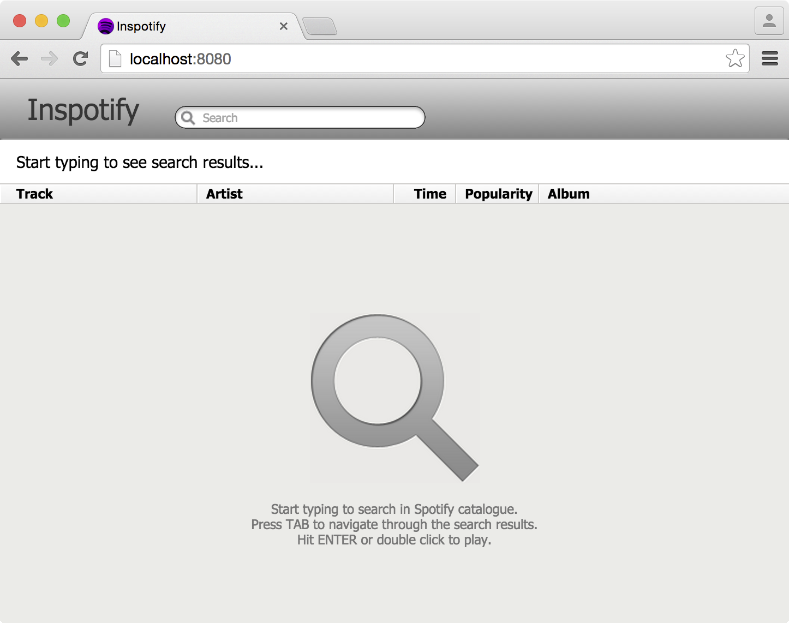

# Inspotify

> Instant Spotify search.

Inspotify shows search results instantly as you type and allows you to play music without even touching the mouse. Just type your search phrase, press TAB to select a track and hit ENTER to play it.

Created back in 2010 inspired by [Google Instant](http://www.google.com/insidesearch/features/instant/about.html). Updated recently to match the current Spotify design and increase performance.

## Try it

http://sin.github.io/inspotify

## Requirements

* [node.js](http://nodejs.org/)
* [bower](http://bower.io/)
* [grunt](http://gruntjs.com/)

## How to install

Download or clone the repo.

```shell
git clone https://github.com/sin/inspotify.git
```

Install required modules and build.

```shell
npm install
bower install
grunt
```

Start the server.

```shell
node serve.js
```

Now go to [http://127.0.0.1:8080/](http://127.0.0.1:8080/)

## Screenshots



